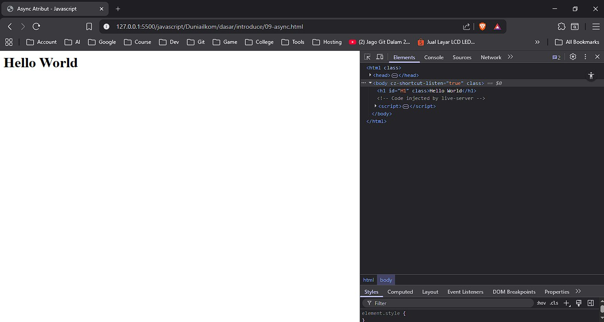
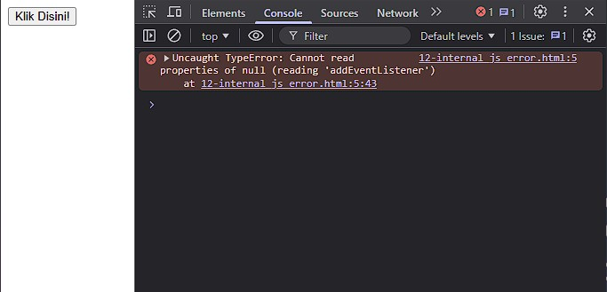
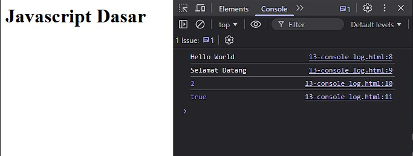
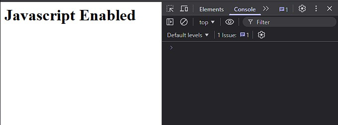
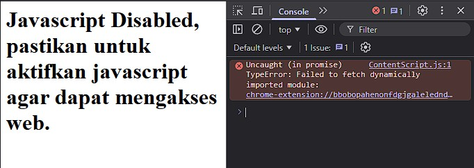

# Mencoba JavaScript

Untuk mencoba menjalankan Javascript, mulai dari persiapan teks editor dan web browser. Pembahasan yang akan dijelaskan adalah mengenai tab console dari developers tools yang ada di web browser.

## 📄 Text Editor

Untuk pemilihan text editor, terserah yang penting text editor. Lebih baik gunakan <b>VS Code</b>, namun jika dirasa berat bisa gunakan <b>ZED</b>.

Mengapa tidak gunakan Notepad++? Silahkan saja jika ingin rumit. Javascript itu seperti cewek yang sensitif, namanya `case sensitif`, dimana huruf kecil dan besar dianggap berbeda.

Jadi gunakan Text Editor yang sesuai standar sekarang agar lebih mudah untuk belajar, jika sudah expert silahkan pake Notepad++.

Download VS Code : [Klik Disini](https://code.visualstudio.com/)

Download ZED : [Klik Disini](https://zed.dev/)

Download Notepad++ : [Klik Disini](https://notepad-plus-plus.org/)

## 🌐 Web Browser

Untuk Web Browser terserah, mau pake Chromium Based atau Gecko Engine terserah. Maksudnya Chroimum Based itu Engine seperti Google Chrome, Opera, Brave, dan lain-lain atau bisa gunakan Gecko Engine itu seperti Mozilla Firefox, Waterfox, dan lain-lain.

Kedua Engine tersebut memiliki kelebih dan kekurangan masing-masing, untuk belajar silahkan gunakan Chorimum Based. Gunakan Google Chrome.

## ⭐ Hello World

Text Editor dan Web Browser sudah terpilih, maka selanjutnya bisa coba membuat teks "Hello World" dengan Javascript. 

> <b>Hello World</b> merupakan suatu hal wajib yang dilakukan para programmer pemula ketika mempelajari bahasa pemrograman baru. Mereka akan menulis teks `hello world` dengan bahasa pemrograman yang dipelajari.

Untuk saat ini kita gunakan DOM untuk menampilkan `hello world` agar dapat berinteraksi dengan kode HTML. Mengapa harus DOM? Silahkan baca kembali mengenai Javascript dan DOM di bagian 01-introduce.md.

Buka teks editor dan ketik kode berikut:

03-hello_world.html
```html
<html>
<head>
    <title>Hello World - Javascript</title>
</head>
<body>
    <h1 id="teksHelloWorld"></h1>
    <script>
        document.getElementById('teksHelloWorld').innerHTML='Hello World';
    </script>
</body>
</html>
```

Menampilkan teks `hello world` dengan javascript DOM harus mengerti kode diatas, untuk sekarang abaikan kode tersebut karena pembahasan mengenai DOM akan di jelaskan setelah paham dasar javascript.

## 📚 Javascript di HTML

Sama seperti CSS, kita dapat menempatkan javascript pada file HTML dengan menggunakan tag `<script>`. Jika sudah mempelajari CSS maka hal ini sudah familiar karena di CSS juga menerapkan hal tersebut meskipun jarang digunakan. Nama dari teknik itu adalah Inline, Internal dan Eksternal.

Untuk sekarang ini kita gunakan DOM Javascript karena berinteraksi dengan element HTML.

### 1️⃣ Inline Javascript

Inline Javascript berarti menempatkan langsung kode javascript pada tag HTML.

berikut contoh penerapan-nya

04-inline_js.html
```html
<html>
<head>
    <title>Inline Javascript - Javascript</title>
</head>
<body>
    <button onclick="document.getElementById('H1').innerHTML='Hello World'">
        Klik Disini!
    </button>
    <h1 id="H1"></h1>
</body>
</html>
```

Didalam tag `<button>` terdapat atribut yang bernama `onclick`. Ini merupakan atribut khusus yang bernama <i>event</i>. Jika kode diatas dijalankan dan kita Klik tombolnya maka akan muncul tulisan `hello world`.

### 2️⃣ Internal Javascript

Untuk Internal javascript sudah kita coba tadi saat membuat tulisan `hello world` menggunakan javascript, dimana butuh tag `<script>` untuk menempatkan kode javascript-nya.

Sekarang kita akan mencoba menghasilkan tulisan `hello world` dengan tombol seperti inline javascript, namun kita gunakan internal javascript

berikut contoh penerapan-nya

05-internal_js.html
```html
<html>
<head>
    <title>Internal Javascript - Javascript</title>
</head>
<body>
    <button id="myClick">Klik Disini!</button>
    <h1 id="H1"></h1>
    <script>
        document.getElementById('myClick').addEventListener("click", () => document.getElementById('H1').innerHTML='Hello World');
    </script>
</body>
</html>
```

Kode nya memang cukup panjang, jika bingung maka tenang saja nanti akan dijelaskan di halaman berikutnya jika sudah sampai.

### 3️⃣ External Javascript

Metode ini sudah jelas bahwa kode Javascript dan HTMl sudah terpisah dan tidak menjadi satu bagian, namun kita dapat memanggil kode javascript ke HTML nya.

Caranya sama seperti Internal Javascript dengan menggunakan tag `<script>` namun terdapat tambahan atribut `src` yang digunakan untuk membuat link pada file javascript yang telah dibuat.

berikut contoh penerapan-nya

06-external_js.html
```html
<html>
<head>
    <title>External Javascript - Javascript</title>
</head>
<body>
    <button id="myClick">Klik Disini!</button>
    <h1 id="H1"></h1>
    <script src="07-external.js"></script>
</body>
</html>
```

07-external.js
```js
document.getElementById('myClick').addEventListener("click", () => document.getElementById('H1').innerHTML='Hello World');
```

<hr/>

Pernah berpikiran tidak? Kenapa External Javascript harus ditaruh dibagian paling bawah untuk kode Javascript-nya? Mengapa tidak seperti External CSS yang ditaruh dibagian atas bertepatan pada tag `<head>`? Jika berpikiran seperti ini, maka ada jawaban yang tepat untuk menjelaskan situasi tersebut.

Jadi, setiap web browser itu memiliki cache, dimana cache ini berfungsi untuk menyimpan data sementara. Ketika web browser menampilkan sebuah halaman dengan HTML dan Javascript didalamnya, maka cache akan mendownload file javascript dan menampilkannya.

Keuntungan? Ketika kita close file tersebut dan membuka-nya kembali, maka web browser tidak perlu lagi mendownload ulang file javascript karena sudah berada di dalam cache dan tinggal ditampilkan saja.

Memang menguntungkan namun terdapat kendala, spesifikasi protocol HTTP menyatakan bahwa web browser harus berhenti memproses HTML pada saat mendownload file external javascript. Hal ini disebut dengan <b>Render-Blocking Javascrit</b>.

Mengapa menjadikan kendala? Karena jika kita tepatkan file javascript di atas sebelum seluruh kode HTML ditampilkan maka akan menampilkan layar kosong, karena web browser akan otomatis berhenti untuk mendownload file javascript tersebut baru menampilkan seluruh halaman HTML.

Inget bahwa setiap eksekusi kode itu berawalan dari atas ke bawah jadi cara untuk menempatkan kode javascript berada dibarisan atas akan menimbulkan masalahan nanti-nya.

## 🎭 Async dan Defer

Rendering-Blocking Javascript akan menjadi masalah ketika kita memakai external Javascript. Hal ini disebabkan karena web browser harus membagi waktu antara mendownload file JavaScript dengan memproses kode HTML.

Untuk Project yang tidak kompleks, masalah ini memang gampang teratasi. Namun untuk project yang sangat kompleks maka kita perlu optimasi-nya.

Untungnya saat ini HTML5 memberikan kita solusi, dengan atribut baru yang diperkenalkan dengan nama `async` dan `defer` membuat kita dapat mengatur bagaimana file external javascript diproses. Selain itu, kedua atribut ini juga memungkinkan kita dapat menulis tag `<script>` dimanapun tidak terbatas pada bawah halaman.

Atribut ini menjawab 2 masalah kita sebelumnya yang harus menaruh tag `<script>` harus dibawah dan mengatur jalan external javascript diproses.

Atribut `async` dan `defer` mengizinkan web browser mendownload file Javascript secara paralel saat memproses HTML, artinya web browser dapat berjalan menampilkan HTML sembari download file javascript

Perbedaan dari kedua atribut itu sangat kompleks dijelaskan, karena itu menjelaskan mengenai proses parser dan fetch. Lebih lengkapnya bisa google sendiri.

08-defer.html
```html
<html>
<head>
    <title>Defer Atribut - Javascript</title>
    <script src="10-kode1.js" defer></script>
    <script src="11-kode2.js" defer></script>
</head>
<body>
    <h1 id="H1"></h1>
</body>
</html>
```

Lihat hasilnya, akan tampil tulisan Hello World, bukan? Harusnya kalau kita tulis kode seperti ini maka halaman HTML akan kosong karena kita taruh tag `<script>` barada diatas, dengan `defer` kita dapat solusi-nya.

09-async.html
```html
<html>
<head>
    <title>Async Atribut - Javascript</title>
    <script src="10-kode1.js" async></script>
    <script src="11-kode2.js" async></script>
</head>
<body>
    <h1 id="H1"></h1>
</body>
</html>
```

## 🔧 Developer Tools

Javascript tidak memiliki pesan error ketika kita gunakan DOM. Berbeda dengan bahasa pemrograman lain yang menampilkan error, javascript harus menggunakan fitur dari web browser yang dinamakan <b>Developer Tools</b> untuk melihat pesan error Javascript.

Cara menggunakan-nya harus buka terlebih dahulu web browser dan bisa gunakan kombinasi keyboard <b>CTRL</b> + <b>SHIFT</b> + <b>I</b>.



Untuk mengakses pesan error pada javascript bisa langsung ke tab <b>Console</b>. Kita akan sering menggunakan tab <b>Console</b> ini untuk debugging Javascript.

Sekarang kita coba menggunakan kode inline Javascript dimana kita akan coba ubah tag `<script>` nya berada di atas dokumen HTML tanpa menggunakan atribut `defer` dan `async`. Hal ini akan menyebabkan error.

berikut contoh penerapan-nya

12-internal_js_error.html
```html
<html>
<head>
    <title>Internal Javascript Error Kode - Javascript</title>
    <script>
        document.getElementById('myClick').addEventListener("click", () => document.getElementById('H1').innerHTML='Hello World');
    </script>
</head>
<body>
    <button id="myClick">Klik Disini!</button>
    <h1 id="H1"></h1>
</body>
</html>
```

Ketika dijalankan, fungsi dari tombol tersebut tidak berfungsi dan ketika kita cek pada developer tools dibagian Console akan muncul error bertuliskan <b><i>"Uncaught TypeError: Cannot read properties of null (reading 'addEventListener')"</i></b>.



## 🟢 Perintah Console Log

Untuk menggunakan Javascript secara utuh tanpa campur tangan DOM adalah dengan cara Developer Tools dan buka Console. Terdapat perintah yang sering digunakan ketika belajar javascript pertama kali dibagian Console yaitu `console.log()`.

Perlu diperhatikan bahwa perintah ini tidak akan menampilkan apa-apa pada dokumen HTMl karena perintah ini berada di dalam console web browser itu sendiri. Hasilnya akan tampil ketika kita membuka console pada developer tools.

berikut contoh penerapan-nya

13-console_log.html
```html
<html>
<head>
    <title>Console Log - Javascript</title>
</head>
<body>
    <h1>Javascript Dasar</h1>
    <script>
        console.log("Hello World");
        console.log("Selamat Datang");
        console.log(1+1);
        console.log(3>1);
    </script>
</body>
</html>
```



## 🔴 NoScript

Javascript dapat dimatikan oleh pengunjung web dengan cara menonaktifkan fitur javascript di web browser mereka. Untuk mengatasi hal ini terciptalah sebuah tag yang dapat digunakan agar javascript harus di hidupkan di web browser untuk mengakses web-nya. Nama tag-nya adalah `<noscript>`.

berikut contoh penerapan-nya

> Untuk melihat perbedaan-nya harus nonaktifkan fitur javascript di web browser, tutornya banyak di google.

14-no_script.html
```html
<html>
<head>
    <title>No Script - Javascript</title>
</head>
<body>
    <h1 id="H1"></h1>
    <script>
        document.getElementById('H1').innerHTML='Javascript Enabled';
    </script>
    <noscript>
        <h1>Javascript Disabled,
            pastikan untuk aktifkan javascript agar dapat mengakses web.
        </h1>
    </noscript>
</body>
</html>
```

Beriku perbandingan antara javascript diaktifkan dan tidak diaktifkan.

### 1️⃣ Javascript Aktif



### 2️⃣ Javascript Tidak Aktif

